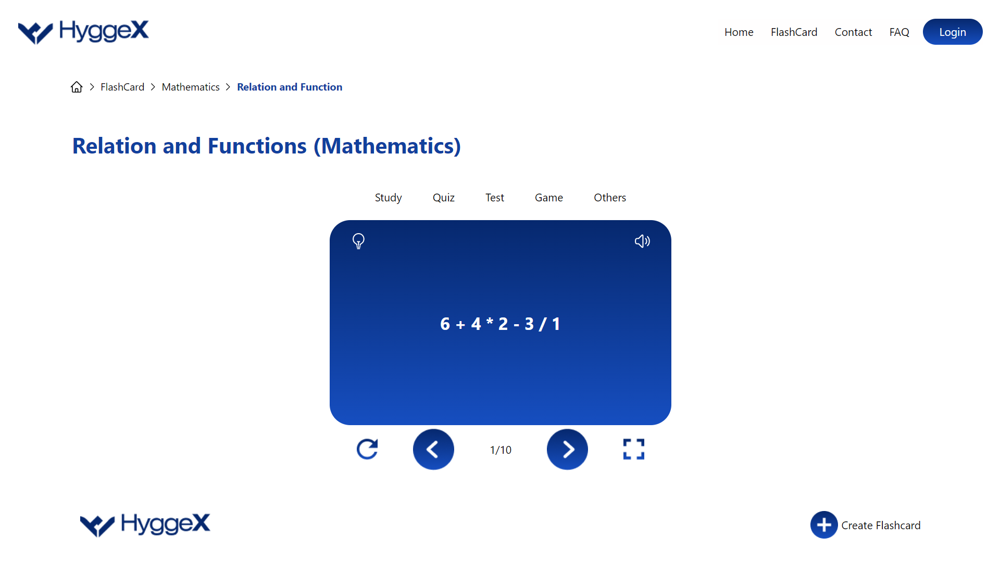

# FlashCard App

## Overview

The FlashCard App is a web application designed to help users study mathematics concepts related to the topic of "Relation and Functions." It provides a set of mathematical expressions for users to practice and understand.

## Features

- **Study Mode:** Explore and solve mathematical expressions related to Relation and Functions.
- **Interactive Interface:** User-friendly interface with navigation controls.
- **Reload and Navigation:** Reload the current flashcard, navigate forward, and backward through the set of expressions.
- **FAQ Section:** Find answers to common questions about the FlashCard App.

## Getting Started

To get started with the FlashCard App, follow these steps:

1. Clone the repository: `git clone https://github.com/your-username/flashcard-app.git`
2. Install dependencies: `npm install`
3. Run the application: `npm start`

## Usage

- Open the application in your web browser.
- Explore different mathematical expressions in the "Study" section.
- Use the navigation buttons to move forward or backward.
- Reload the current flashcard if needed.

## Contributing

If you would like to contribute to the development of the FlashCard App, please follow these guidelines:

1. Fork the repository.
2. Create a new branch: `git checkout -b feature/new-feature`
3. Make your changes and commit them: `git commit -m 'Add new feature'`
4. Push to the branch: `git push origin feature/new-feature`
5. Create a pull request.

## FAQ

### Can education flashcards be used for all groups?

Yes, the education flashcards provided in this app can be used by learners of all groups.

### How do education flashcards work?

Education flashcards help users study mathematical concepts interactively. Users can navigate through different expressions, providing a practical learning experience.

### Can education flashcards be used for test preparation?

Absolutely! These flashcards cover a range of mathematical expressions related to Relation and Functions, making them suitable for test preparation.
